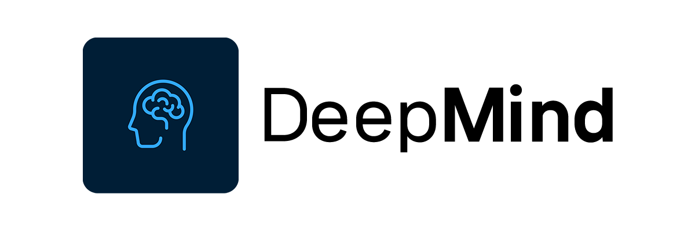

 
# DeepMind 
### Check your psychological status with ML, based on YOLOv8 

#### Introduction

|Classes|Detection|
|-------|---------|
|House (CL01)|Whole House, Roof, Wall, Door, Window, Chimney, Smoke, Fence, Road, Pond, Mountain, Tree, Flower, Grasses, Sun|
|Tree (CL02)|Whole Tree, Pillar, Crown, Branch, Root, Leaves, Flowers, Fruit, Swing, Bird, Cloud, Moon, Stars|
|Person_Male (CL03)|Whole Person, Head, Face, Eyes, Nose, Mouth, Ears, Hair, Neck, Upper body, Arm, Hand, Leg, Button, Pocket, Snickers, SHoes for male|
|Person_Female (CL04)|Whole Person, Head, Face, Eyes, Nose, Mouth, Ears, Hair, Neck, Upper body, Arm, Hand, Leg, Button, Pocket, Snickers, SHoes for female|

 

#### Model Accuracy

|Classes|Precision|mAP-50|mAP50-95|
|-------|---------|------|--------|
|House (CL01)|94.8%|97.4%|90.1%|
|Tree (CL02)|97.3%|98.7%|88.9%|
|Person_Male (CL03)|Preparing|
|Person_Female (CL04)|Preparing|

 

#### Model Training Environment

|Category|Contents|
|-------|---------|
|CPU|Intel(R) Core(TM) i9-13900K|
|RAM|128GB|
|GPU|NVIDIA Geforce RTX 3090Ti|
|Software|Python 3.9 CUDA 11.8 PyTorch 2.0.1 |